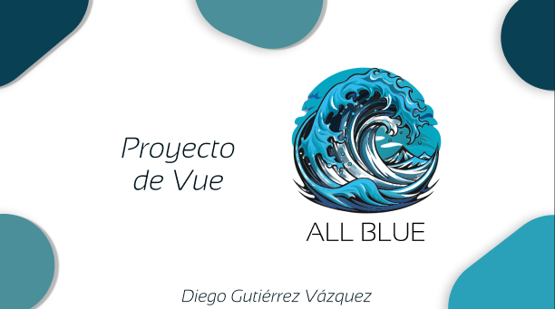

# Índice

1. [Idea de la aplicación](#idea-de-la-aplicación)
2. [Tecnologías a utilizar](#tecnologías-a-utilizar)
3. [Guía de estilos](#guía-de-estilos)
4. [Resultados obtenidos](#resultados-obtenidos)
5. [Instalación del proyecto](#instalación-del-proyecto)
6. [Desarrollo](#desarrollo)
7. [Despliegue](#despliegue)
8. [Manual](#manual)
9. [Accesibilidad](#manual)
10. [Conclusiones](#conclusiones)

## Idea de la aplicación

La propuesta se centra en el  desarrollo de una página de comercio, con un enfoque similar a los más grandes como Aliexpress o Amazon. La aplicación tiene como objetivo principal ofrecer a los usuarios la mejor experiencia posible en cuanto al manejo y utilización de de la misma, para ello se incluirá un carrito de compra para que los usuarios puedan gestionar sus compras de manera eficiente, un buscador que permita al usuario encontrar lo que quiera en momentos ,además de la implementación de categorías para permitir una navegación lo más fluida e inmersiva posible.Posiblemente, se incorporará una funcionalidad de chat que permitirá la interacción entre los usuarios, la cual , ayuda a los administradores y a los usuarios saber la calidad de los productos que encontrarás. 

## Tecnologías a utilizar

Para la implementación del proyecto , voy a utilizar Vue.js, un framework moderno y versátil que facilita el desarrollo de interfaces de usuarios dinámicas y atractivas.Para las funcionalidades principales, se implementara una API propia , parecida a Platzi Fake Store,la cual dispondrá de diversos tipos de artículos.para el chat, se optará por Disqus, una plataforma consolidada que garantiza una comunicación fluida entre los usuarios.Además,se evaluará la integración de otras posibles APIs con el propósito de mejorar aún más la experiencia del usuario.

Funcionalidades Clave:

Carrito de compra:
El desarrollo incluirá la implementación de un carrito de compra robusto y fácil de usar. Los usuarios podrán agregar, editar y eliminar productos de manera intuitiva. La funcionalidad permitirá un cálculo en tiempo real del total de la compra, ofreciendo una experiencia de compra transparente y eficiente. Asimismo, se simulará el proceso de pago para proporcionar a los usuarios una vista previa realista de sus transacciones.

Búsqueda de productos:
Se incorporará una potente funcionalidad de búsqueda que permitirá a los usuarios encontrar productos específicos de manera rápida y eficiente. La inclusión de filtros y categorías facilitará la exploración de la tienda, brindando a los usuarios opciones de personalización para afinar sus búsquedas y descubrir productos relevantes de manera efectiva.

Chat entre usuarios(Según el tiempo)
Se introducirá un sistema de chat que permitirá a los usuarios interactuar y compartir opiniones sobre productos y servicios. La implementación de esta función dependerá de la disponibilidad de tiempo en el desarrollo, asegurando una integración cuidadosa para ofrecer una experiencia de usuario fluida y segura
 
Audiencia Objetivo:

La plataforma está diseñada para atender a una amplia audiencia, abarcando usuarios de todas las edades y perfiles. Al no incluir productos exclusivos para mayores de 18 años, se busca llegar a un público diverso.Esta propuesta busca no solo ofrecer una experiencia de compra efectiva, sino también establecer una conexión más significativa entre los usuarios, promoviendo un ambiente interactivo y social en la plataforma.

## Guía de estilos
[Enlace al Figma](https://www.figma.com/file/AKtjTzrGazoxUcZ97ScBey/Vue-project-1?type=design&node-id=1-7&mode=design&t=tGGIAE6cs8Phfv43-0)

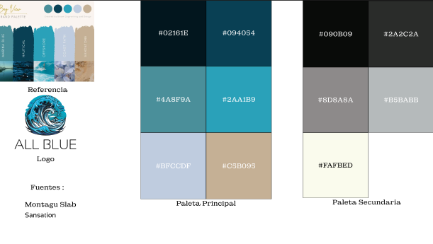

Resultado:

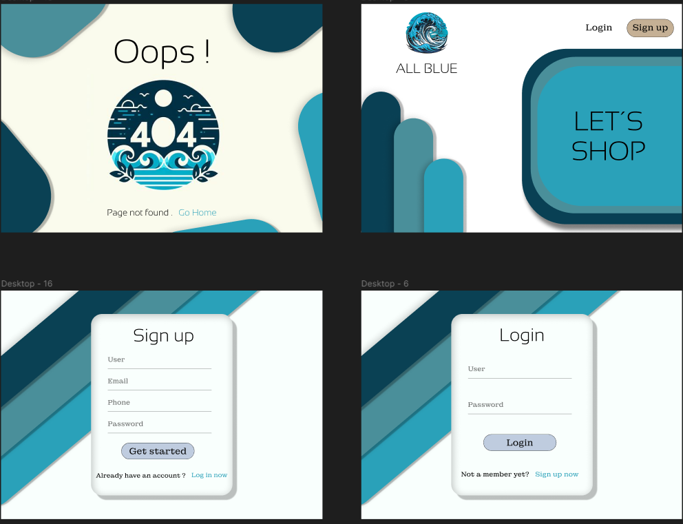

En esta imagen , podemos ver la parte inicial del proyecto, la cual cuenta con la página de error , la página inicial y sus respectivos iniciar sesión y registro

En la siguiente imágen, podemos ver la parte principal , a esta solo se puede acceder si el usuario , ha iniciado sesión o se ha registrado.En esta parte contaremos con un navbar, footer y las partes principales de cada página.

Cuenta con dos páginas , una es la principal y la otra tendrá información del usuario y el chat.En la principal podemos encontrar los productos , el buscador , los filtrados , el carrito y el contacto en la parte del footer.
y por último esta es la misma versión pero con su modo oscuro:

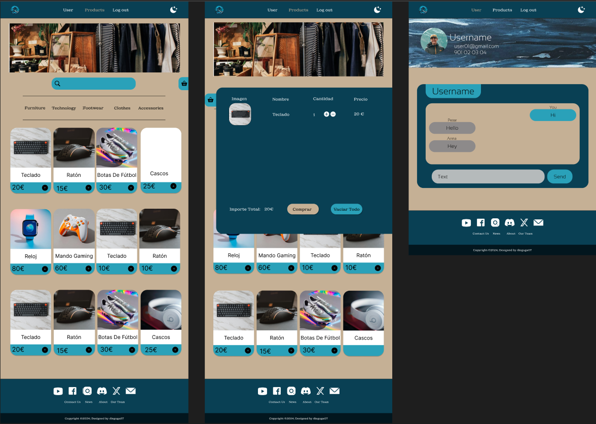

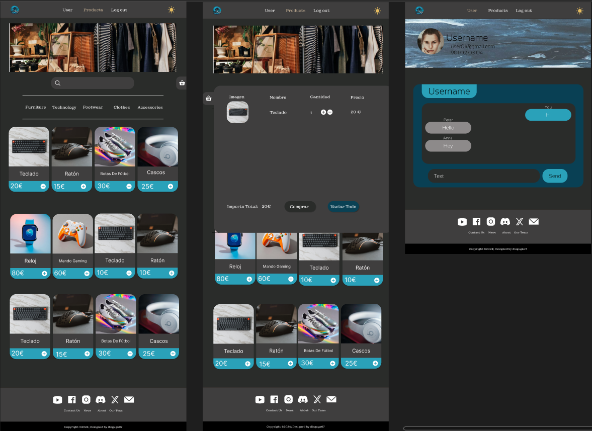

## Resultados obtenidos

El resultado final ha sido este:

Parte inicial:

En esta parte encontraremos los formularios de registro , login y la página inicial.

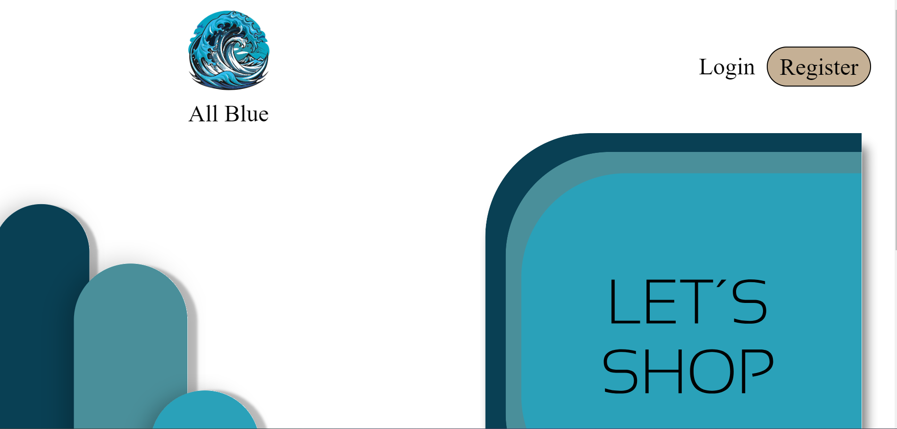

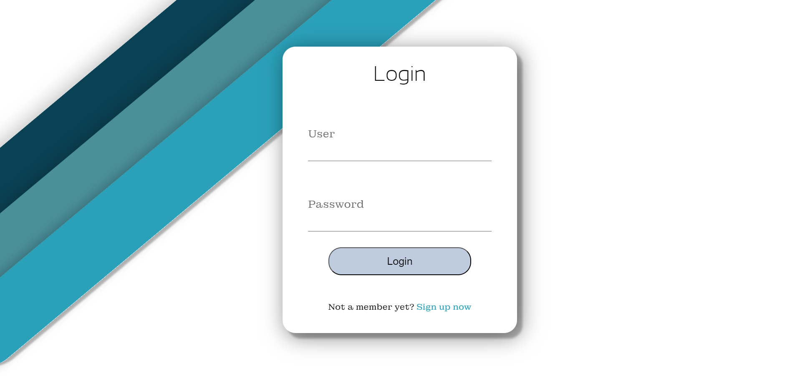

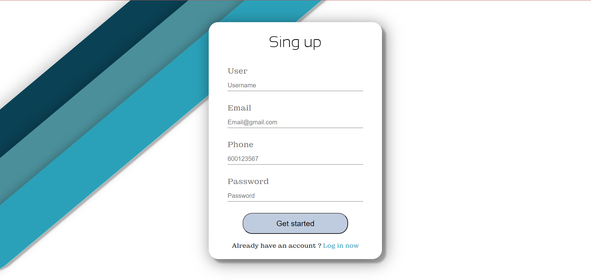

Parte principal:

Encontramos aquí la funcionalidad principal del proyecto en la que tenemos las peticiones a la API y sus distintos usos.


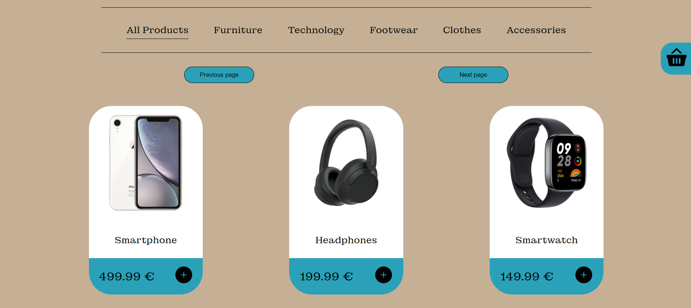

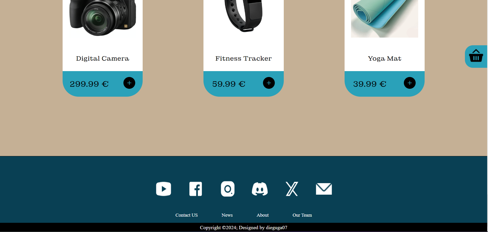

El apartado de usuario , el cual nos muestra información y permite administralo.

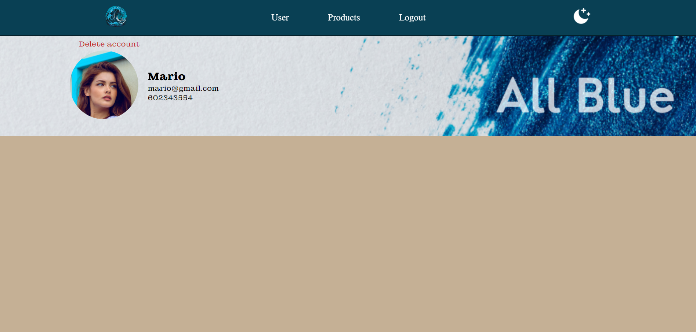

Contacto:

Formulario de contacto con el responsable del proyecto.

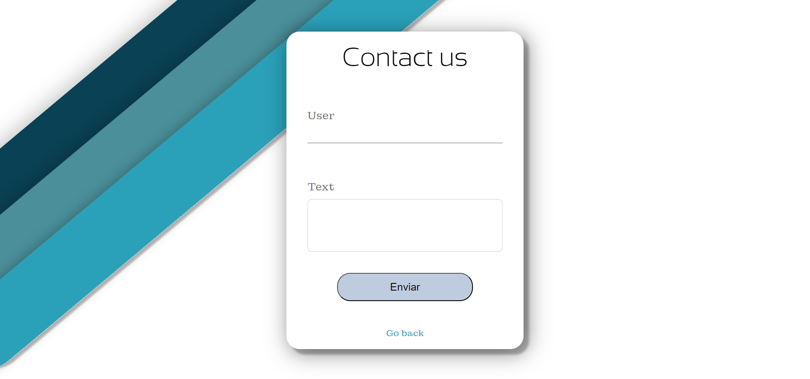

## Instalación del proyecto

Instrucciones detalladas sobre cómo instalar y configurar el proyecto en un entorno local.

## Desarrollo

Para iniciar el proyecto, decidí comenzar por diseñar la base de datos que utilizaría y establecer los objetivos que deseaba alcanzar con ella. Una vez completado este paso, procedí con el desarrollo del cliente, el cual está implementado en Vue. Simultáneamente, fui aplicando el estilo necesario para que todo adquiriera coherencia visual.

Una vez que lo esencial estuvo completado, me concentré en la parte del servidor. Creé la API en Laravel y la utilicé para la creación del producto final. Durante este proceso de desarrollo, me encontré con varios errores, los cuales pude resolver gradualmente gracias a fuentes externas y a las indicaciones proporcionadas por el profesorado.

Comparado con mi proyecto anterior, las dificultades encontradas fueron menores, ya que algunas de ellas fueron similares a las que enfrenté previamente, lo que me permitió abordarlas de manera más eficiente y con menos tiempo de resolución.

Durante la fase de desarrollo, he atravesado varias etapas, algunas en las que todo fluía sin problemas, y otras en las que me enfrentaba a dificultades significativas. En ocasiones, incluso cuando todo parecía estar en orden, me encontraba con pequeños detalles, como olvidar un "this" o un punto y coma, lo que subraya la complejidad de este primer encuentro con un proyecto de cierta envergadura.


## Despliegue


El despliegue ha sido un poco complicado, pero finalmente logré implementar la parte del frontend utilizando Vercel, mientras que la parte del backend se ejecuta localmente. Para poder utilizar la aplicación, todo lo que necesitas hacer es descargar el proyecto y ejecutar el siguiente comando en la terminal:

[Repositorio Backend](https://github.com/dieguga07/Laravel-project-All-BLue)

```sh 
docker-compose up -d --build 

```
En caso de que esta opción no funcione, también puedes realizar una instalación manual del frontend descargando el proyecto y ejecutando los siguientes comandos:

[Repositorio Frontend](https://github.com/dieguga07/Vue-project-All-Blue-)


```sh
npm install
```

Asegurate de tener las siguientes dependencias que se usan en el pryecto:

[Pinia](https://pinia.vuejs.org/getting-started.html)
[Vue router](https://router.vuejs.org/guide/)
[Pinia-plugin-persist](https://www.npmjs.com/package/pinia-plugin-persist)

###### Compile and Hot-Reload for Development

```sh
npm run dev
```

###### Compile and Minify for Production

```sh
npm run build
```
Estos pasos te permitirán poner en marcha la aplicación sin problemas.

¡¡¡ Importante !!! Es posible que la respuesta tarde varios segundos debido al retraso en el despliegue del backend.

## Manual

Para utilizar la aplicación, los usuarios deben iniciar sesión o registrarse. Una vez completado este paso, accederán a la parte principal de la aplicación, donde encontrarán un catálogo de productos con varios filtros disponibles y la opción de agregar elementos al carrito para realizar compras. Además, los usuarios tendrán acceso a una sección personalizada donde podrán ver y gestionar su información personal, incluida la posibilidad de eliminar su cuenta si así lo desean.

[Video explicativo](https://drive.google.com/file/d/1WZNZZCCU2UYaVjy8ZLSseuqHp3U2glh1/view?usp=sharing) 

## Accesibilidad


En lo que respecta al contenido sobre accesibilidad, aparentemente todo está en orden, aunque se observan algunos pequeños fallos que pueden ser justificados. Estos pueden ser corregidos utilizando la paleta de colores de manera más coherente y procurando ajustarse a ella en la medida de lo posible. Asimismo, algunos elementos podrían pasar desapercibidos al estar ubicados detrás de una imagen que sirve de fondo, como sucede en la sección del usuario, donde el botón de eliminar cuenta podría no ser tan visible como se desearía.

## Conclusiones

Este proyecto ha representado un hito significativo en mi aprendizaje, marcando una notable brecha entre mis conocimientos previos y lo que he adquirido a lo largo del proceso. Observar la evolución que he experimentado me llena de orgullo por los logros alcanzados hasta el momento, aunque reconozco que siempre hay margen para la mejora continua.

En cuanto al proyecto en sí, siento que he dado un salto considerable en comparación con el anterior. Quizás esto se deba a que en el proyecto anterior estaba explorando y aprendiendo a manejarme, lo cual me ha permitido evitar errores anteriores. Aunque el resultado final no se ajusta completamente a mi visión inicial, me hubiera gustado dotarlo de más funcionalidades y mejorar su aspecto visual, así como facilitar su uso para el usuario. En particular, la implementación de un chat, que estaba destinado a ser el núcleo del proyecto, tuvo que ser postergada debido a limitaciones de tiempo.
